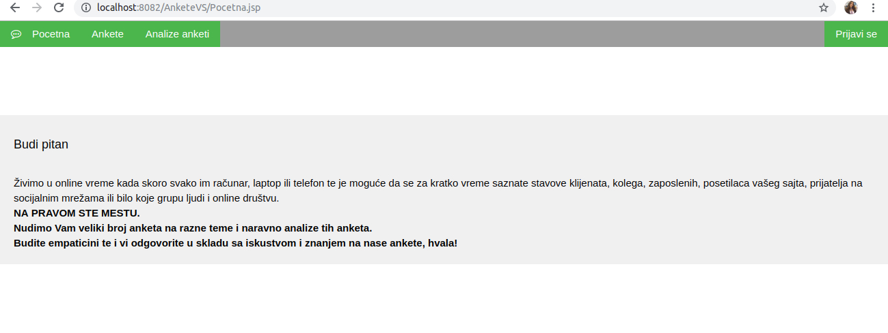
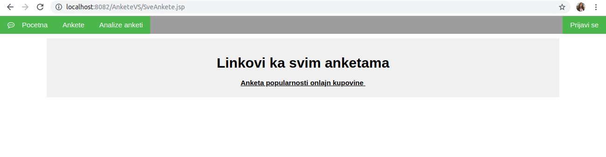
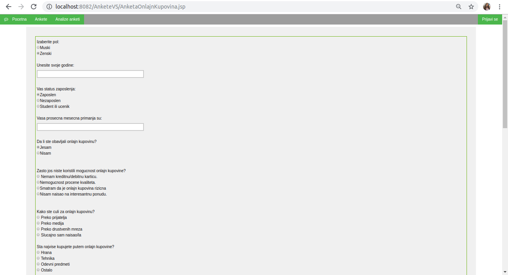
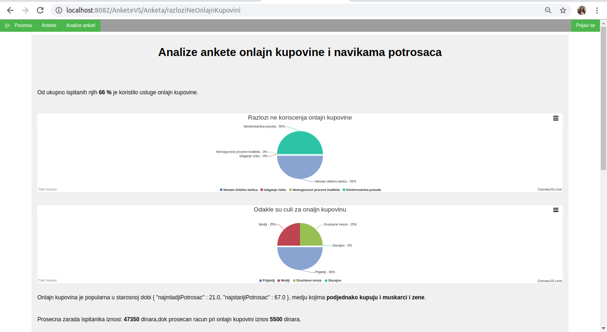
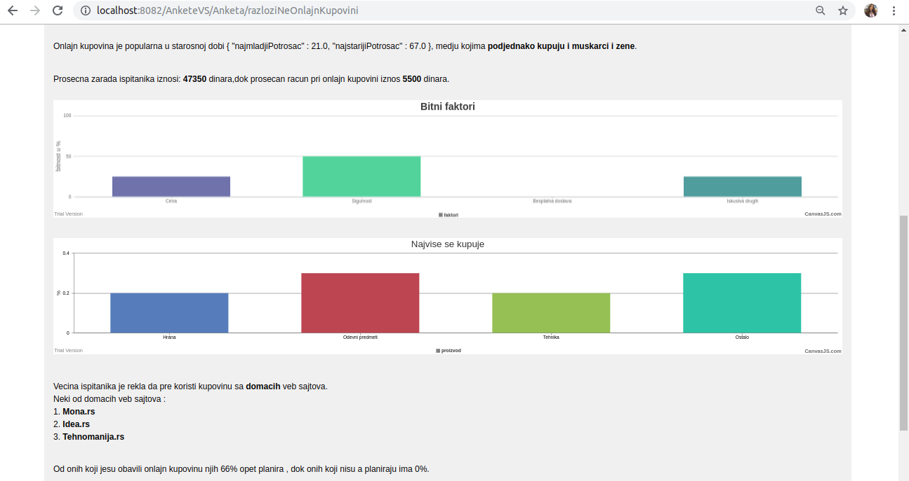

# The popularity of online shopping - survey-app
> A web application for polling, processing survey data and displaying results.

## Table of contents
* [General info](#general-info)
* [Screenshots](#screenshots)
* [Task](#task)
* [Technologies](#technologies)
* [Functionality](#functionality)
* [Status](#status)

## General info
The project describes and implements the development of a survey system as well as a survey analysis, in this case especially on the popularity of the use of online shopping.
The motivation for this application is to answer the question of how to best reap the benefits of Nosql databases.

## Screenshots
 
 
 
 
 

## Task
The task of the application is to enable the respondent to answer the survey questions, to store the respondent's answers, where everything will be anonymous. Processing of data obtained through the answers of the respondents and presentation of the data obtained.

## Technologies
* HTML5
* CSS
* JavaScript, I used the Chart.JS to show the survey results as visually as possible.
* Java, Spring Boot framework-it was used to implement business logic.
* MongoDB- Instead of the traditional structure of relational database tables, MongoDB is document-oriented and survey-         friendly.The base was not installed locally and NoSql Booster was used to access the base.

## Functionality
The user accesses the application, after which he can see all active polls and choose which one he wants to answer. After the user completes the survey, all the answers are stored in the database and the results of the selected survey are automatically updated. The user can see the results of all surveys.
A MapReduce was used to implement a slightly more complex method.

## Status
Project is: _finished_

## Contact
Created by [@ValentinaSimic](https://github.com/ValentinaSimic) - feel free to contact me!

